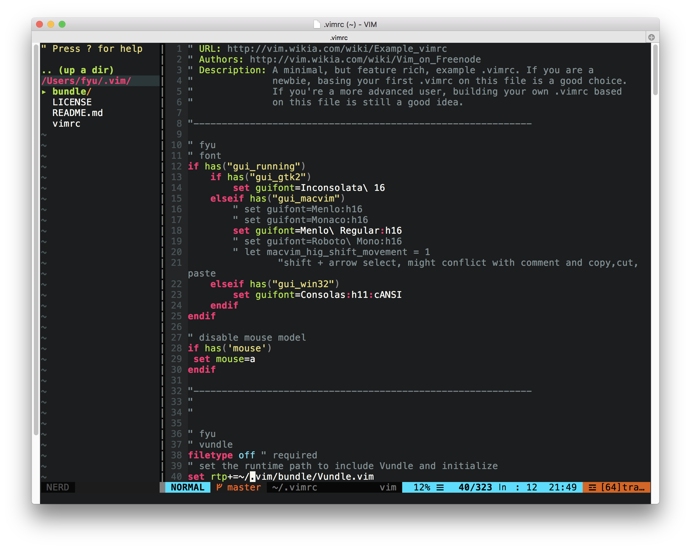

My vim configuration.

Author: Feng George Yu

This vimrc example is based on the following example:

* URL: http://vim.wikia.com/wiki/Example_vimrc

## Install

First, download the git repo and link the `vimrc` to your home folder `.vimrc`

```bash
git clone --recursive https://github.com/fenggeorgeyu/_vim.git ~/.vim
ln -s ~/.vim/vimrc ~/.vimrc
```

Second, start vim, type `:` and type `PluginInstall` to install plugins. Restart vim and start using it.

## Install `YouCompleteMe`

Support C-family languages, Go, and Java:

	brew install cmake go
	cd ~/.vim/bundle/youcompleteme/
	python3 ./install.py --clang-completer --go-completer --java-completer 


## Other Issues

* For `golang` the `vim-go` requires newer version of vim. The warning is disabled in `vimrc`.

## Screenshot


